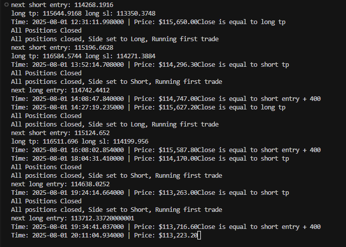

# Hedging Strategy Trading Bot

## Overview

This is a grid-based hedging strategy for cryptocurrency futures trading on Binance. The strategy implements an automated trading system that can profit from price reversals by creating hedged positions with dynamic position sizing based on risk levels.

## ⚠️ Important Disclaimer

**This software is for educational and testing purposes only.**
- Use only with Binance Testnet, NOT live trading
- Cryptocurrency trading involves substantial risk
- Past performance does not guarantee future results
- Always test thoroughly before any live implementation
- Consider consulting with financial advisors

## How the Strategy Works

### Core Concept
The strategy operates on a **grid-based hedging principle**:

1. **Risk Assessment**: Calculates position size based on account balance and risk level
2. **Initial Position**: Opens either a LONG or SHORT position with calculated size
3. **Hedging Trigger**: When price moves 0.4% against the current position, opens an opposite position
4. **Position Management**: Maintains both LONG and SHORT positions simultaneously
5. **Profit Taking**: Closes all positions when price reaches take-profit levels (0.8%)
6. **Cycle Restart**: Begins a new cycle after position closure

### Strategy Flow

```
Start → Calculate Position Size → Open Initial Position (LONG/SHORT)
  ↓
Price moves 0.4% against position
  ↓
Open opposite position (creates hedge)
  ↓
Price continues moving
  ↓
Take profit at 0.8% → Close all positions
  ↓
Restart cycle
```

### Key Parameters

| Parameter | Value | Purpose |
|-----------|-------|---------|
| Entry Distance | 0.4% | Distance for triggering opposite position |
| Take Profit | 0.8% | Profit target for closing all positions |
| Stop Loss | 1.2% | Emergency stop loss (currently unused) |
| Leverage | 50x | Position leverage multiplier |

## Risk Management System

### Dynamic Position Sizing
The bot now implements a **risk-based position sizing system** that automatically calculates the optimal position size based on your account balance and selected risk level.

### Risk Levels

#### 🟢 Low Risk
- **Max Trades**: 10 levels
- **Account Usage**: ~90% of available balance
- **Safety Buffer**: 10% for fees
- **Recommended For**: Beginners, conservative traders

#### 🟡 Medium Risk  
- **Max Trades**: 8 levels
- **Account Usage**: ~90% of available balance
- **Safety Buffer**: 10% for fees
- **Recommended For**: Experienced traders

#### 🔴 High Risk
- **Max Trades**: 6 levels
- **Account Usage**: ~90% of available balance
- **Safety Buffer**: 10% for fees
- **Recommended For**: Advanced traders only

### Position Size Calculation Formula
```
Available Balance = USDT Balance × 0.9 (10% buffer for fees)
Initial Margin = Available Balance ÷ (2^max_trades - 1)
Position Size = Initial Margin ÷ Current Price
```

**Example (High Risk):**
- USDT Balance: $10,000
- Available Balance: $9,000 (after 10% buffer)
- Max Trades: 6 levels
- Initial Margin: $9,000 ÷ (2^6 - 1) = $9,000 ÷ 63 = $142.86
- Position Size: $142.86 ÷ $50,000 = 0.00286 BTC

## Setup Instructions

### 1. Prerequisites
```bash
pip install -r requirements.txt
```

### 2. Environment Setup
1. Copy the example environment file:
   ```bash
   cp env_example.txt .env
   ```

2. Edit the `.env` file with your Binance API credentials:
   ```
   BINANCE_API_KEY=your_api_key_here
   BINANCE_SECRET_KEY=your_secret_key_here
   ```

### 3. Binance Testnet Setup
1. Create account at [Binance Testnet](https://testnet.binance.vision/)
2. Generate API keys
3. Fund testnet account with test USDT

### 4. Configuration
```python
# Trading parameters (modify these)
symbol = "BTCUSDT"                    # Trading pair
leverage = 50                         # Leverage multiplier
side = "LONG"                         # Initial direction
risk = "High"                         # Risk level: "Low", "Medium", "High"

# Strategy parameters
long_entry_add = 0.4/100             # 0.4% entry distance
short_entry_deduct = 0.4/100         # 0.4% entry distance
long_tp_add = 0.8/100                # 0.8% take profit
short_tp_deduct = 0.8/100            # 0.8% take profit
```

### 5. Running the Bot
```bash
python main.py
```

**Note**: The bot will automatically close any existing positions before starting the strategy.

### 6. Real-Time Trading Display

When running, the bot displays real-time trading information in the terminal. Here's what you'll see:



**Key Information Displayed:**
- **Trade Entries**: Price, order ID, and quantity for each position
- **Price Levels**: Take-profit and stop-loss levels for current positions
- **Next Entry**: Target price for the next opposite position
- **Real-Time Updates**: Timestamp and current market price
- **Trade Outcomes**: Reason for position closure (take-profit, stop-loss, or entry trigger)
- **System Status**: Position closure confirmations and strategy restarts

## Risk Management Guidelines

### 1. Capital Allocation
- **Never risk more than 1-2% of total capital per trade**
- **Recommended maximum: 5% of capital in active positions**
- **Keep 80-90% of capital in reserve for emergencies**

### 2. Risk Level Selection

#### Conservative Approach (Low Risk)
```python
risk = "Low"
# Recommended for: Beginners, small accounts
# Account Size: $1,000+
# Max Exposure: ~2% of account
```

#### Moderate Approach (Medium Risk)
```python
risk = "Medium"
# Recommended for: Experienced traders
# Account Size: $5,000+
# Max Exposure: ~4% of account
```

#### Aggressive Approach (High Risk)
```python
risk = "High"
# Recommended for: Advanced traders only
# Account Size: $10,000+
# Max Exposure: ~6% of account
```

### 3. Risk Management Rules

#### Before Trading:
- ✅ Test on Binance Testnet first
- ✅ Start with Low risk level
- ✅ Set maximum daily loss limits
- ✅ Have emergency stop procedures

#### During Trading:
- ✅ Monitor position exposure continuously
- ✅ Don't increase risk levels during losses
- ✅ Have a maximum drawdown limit (e.g., 10%)
- ✅ Keep detailed trading logs

#### Emergency Procedures:
- ❌ Never panic sell
- ❌ Don't override automated systems manually
- ❌ Don't increase leverage to recover losses

### 4. Market Conditions to Avoid

**Low Liquidity:**
- Low volume periods
- Thin order books
- Weekend trading (for some pairs)

## Strategy Advantages

### ✅ Pros
- **Automated**: No emotional trading decisions
- **Hedged**: Reduces directional risk
- **Dynamic Sizing**: Automatically calculates optimal position size
- **Risk-Based**: Multiple risk levels for different trader types
- **Scalable**: Can handle multiple positions
- **Backtested**: Can be tested on historical data
- **Real-time**: Responds to market changes instantly

### ⚠️ Cons
- **Complex**: Requires understanding of futures trading
- **Risky**: High leverage can amplify losses
- **Market Dependent**: Performance varies with market conditions
- **Technical**: Requires reliable internet and system uptime

## Security Best Practices

### API Key Security
- ✅ Use environment variables (`.env` file)
- ✅ Never commit API keys to version control
- ✅ Use testnet API keys for development
- ✅ Regularly rotate API keys
- ✅ Set appropriate API key permissions

### Code Security
- ✅ Keep dependencies updated
- ✅ Use virtual environments
- ✅ Follow secure coding practices
- ✅ Review code regularly

## Performance Monitoring

### Key Metrics to Track
1. **Win Rate**: Percentage of profitable cycles
2. **Average Profit**: Average profit per completed cycle
3. **Maximum Drawdown**: Largest peak-to-trough decline
4. **Sharpe Ratio**: Risk-adjusted returns
5. **Position Exposure**: Total open position value
6. **Risk-Adjusted Returns**: Performance relative to risk level

### Recommended Monitoring Tools
- Trading journal (Excel/Google Sheets)
- Performance dashboard
- Risk metrics calculator
- Real-time position monitor

## Advanced Configuration

### Customizing Strategy Parameters

```python
# More conservative settings
long_entry_add = 0.3/100             # 0.3% entry distance
long_tp_add = 0.6/100                # 0.6% take profit

# More aggressive settings
long_entry_add = 0.5/100             # 0.5% entry distance
long_tp_add = 1.0/100                # 1.0% take profit
```

### Multiple Timeframes
```python
bar_length = "1m"                     # 1-minute candles
# Alternative: "5m", "15m", "1h"
```

### Different Trading Pairs
```python
symbol = "ETHUSDT"                    # Ethereum
symbol = "ADAUSDT"                    # Cardano
symbol = "DOTUSDT"                    # Polkadot
```

## Troubleshooting

### Common Issues

**1. API Connection Errors**
- Check internet connection
- Verify API keys are correct in `.env` file
- Ensure testnet URL is used

**2. Environment Variable Errors**
- Make sure `.env` file exists
- Check that API keys are properly set
- Verify `python-dotenv` is installed

**3. Position Not Opening**
- Check account balance
- Verify leverage settings
- Ensure dual-side position mode is enabled
- Check if position size calculation is working

**4. Unexpected Behavior**
- Review strategy parameters
- Check market conditions
- Monitor position tracking variables
- Verify risk level selection

### Debug Mode
Uncomment debug prints in the code:
```python
#print('Hedging loop started')
#print('Last direction is Long')
```

## Legal and Compliance

### Important Notes
- This is educational software only
- Not financial advice
- Test thoroughly before any live use
- Comply with local trading regulations
- Consider tax implications

### Risk Warnings
- Cryptocurrency markets are highly volatile
- Leverage trading can result in significant losses
- Past performance doesn't guarantee future results
- Only trade with capital you can afford to lose

## Support and Resources

### Learning Resources
- [Binance Futures Documentation](https://binance-docs.github.io/apidocs/futures/en/)
- [Python-Binance Library](https://python-binance.readthedocs.io/)
- [Technical Analysis Resources](https://www.investopedia.com/technical-analysis-4689657)

### Community
- Binance Community Forum
- Trading Discord servers
- Reddit trading communities

---

**Remember: The best strategy is the one you understand and can stick to consistently. Always prioritize risk management over potential profits. Start with Low risk and gradually increase as you gain experience.**